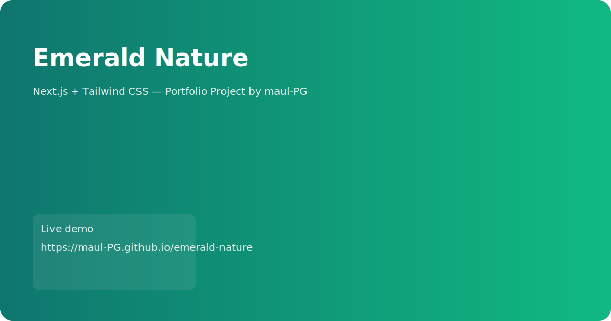

# Emerald Nature

Repository untuk proyek Next.js + Tailwind CSS: "Emerald Nature".

## Ringkasan
Aplikasi ini dibangun dengan Next.js (App Router) dan Tailwind CSS. Struktur proyek sudah ada di folder `src/app` dan `src/components`.

# Emerald Nature



Emerald Nature — personal portfolio project by Rafi'i Maulana (maul-PG).

Repository: https://github.com/maul-PG/emerald-nature

Contact: maulanarafii036@gmail.com

<!-- Badges: build | dependabot | license | live -->

[](https://github.com/maul-PG/emerald-nature/actions)
[](https://github.com/maul-PG/emerald-nature/security/dependabot)
[](./LICENSE)
[](https://<your-vercel-domain>)

## Overview
Emerald Nature is a showcase project built with Next.js (App Router) and Tailwind CSS. It demonstrates responsive design, reusable components, and a few light visual effects suitable for a modern portfolio website.

This README is optimized for presentation: it includes a short project summary, quick setup, highlights to mention during a demo, and links for contact and live demo.

## Tech stack
- Next.js (App Router)
- React + TypeScript (if TypeScript is enabled in the repo)
- Tailwind CSS
- Node.js (18+ recommended)

## Key highlights to present
- Clear component structure in `src/components` for reuse and maintainability
- Tailwind-based utility-first styling for rapid UI iteration
- Small UI effects: particles, reveal-on-scroll, magnetic buttons (non-blocking)
- Production-ready build and CI pipeline (GitHub Actions)

## Quick start (local)
1. Clone the repository

  git clone https://github.com/maul-PG/emerald-nature.git
  cd emerald-nature

2. Install dependencies

  npm install

3. Copy example env and edit if needed

  copy .env.example .env.local

Note for Windows PowerShell: use `copy` as above; on macOS/Linux use `cp`.

4. Run development server

  npm run dev

5. Open http://localhost:3000

## Scripts (expected)
- npm run dev  — start dev server
- npm run build — build for production
- npm run start — start production server
- npm run lint — run linter (if configured)
- npm test — run tests (if any)

## Deploy
Recommended: Vercel (1-click deploy from GitHub). After deploying, add the Live Demo URL to the top of this README so recruiters can access it directly.

## Screenshots / Social Preview
Place screenshots or screen recordings in the `public/` folder and reference them here. Example placeholders are `public/screenshot.svg` and `public/og-image.svg`.
To replace the placeholders with real images (recommended):

1. Take a screenshot or export a GIF of the site (recommended resolution for hero: 1200×630).
2. Place the file into `public/` (e.g. `public/screenshot.png` and `public/og-image.png`).
3. Commit and push. The README preview and social cards will update on GitHub.

If you have the SVG placeholders and want a quick PNG export locally, you can use a tool like ImageMagick (Windows: install via Chocolatey) and run:

```powershell
magick convert public/og-image.svg -resize 1200x630 public/og-image.png
```

Or use a browser's "Save as PNG" from devtools when viewing the SVG.
## Contributing
See `CONTRIBUTING.md` for contribution guidelines and code standards.

## Security
If you discover a security issue, please contact: maulanarafii036@gmail.com (see `SECURITY.md`).

## License
MIT — see `LICENSE`

---
Maintainer: Rafi'i Maulana — https://github.com/maul-PG
